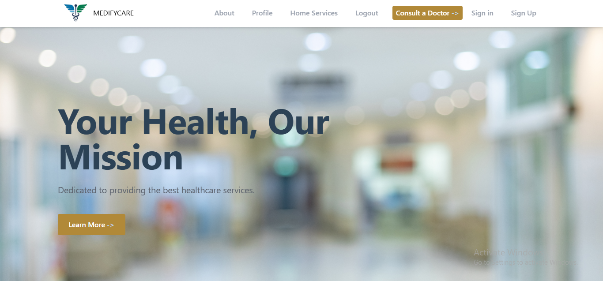
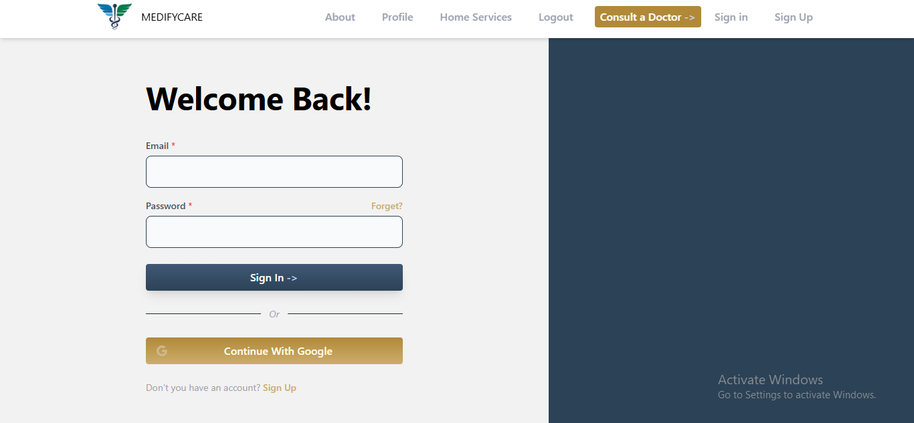
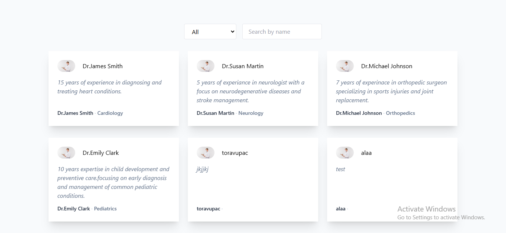

## **Installation**

To set up the project locally:

1. Clone the repository:

    ```sh
    git clone https://github.com/alaahamed1/ALX-graduation-project.git
    cd ALX-graduation-project
    ```

2. Install the dependencies:

    ```sh
    npm install
    ```

3. Run the JSON server:

    ```sh
    npm run server
    ```

4. Start the application:

    ```sh
    npm start
    ```

    Runs the app in development mode. Open [http://localhost:3000](http://localhost:3000) to view it in your browser.

### The structure of the repository

```bash
    ├── public
    │   ├── index.html
    │   └── ...
    ├── src
    │   ├── api
    │   │   ├── doctors.json
    │   │   └── services.json
    │   ├── components
    │   │   ├── about
    │   │   │   ├── SliderService.jsx
    │   │   │   └── SecTwo.jsx
    │   │   ├── auth
    │   │   │   ├── SignIn.jsx
    │   │   │   ├── SignUp.jsx
    │   │   │   └── ...
    │   │   ├── home
    │   │   │   └── Hero.jsx
    │   │   ├── Header.jsx
    │   │   ├── Footer.jsx
    │   │   └── ...
    │   ├── pages
    │   │   ├── About.jsx
    │   │   ├── Consult.jsx
    │   │   ├── HomeService.jsx
    │   │   └── ...
    │   ├── App.js
    │   ├── index.js
    │   └── ...
    ├── package.json
    └── README.md
```

You can also take a look at my commit history on this repository: [MedifyCare_new](https://github.com/alaahamed1/MedifyCare_new)

## **License**

This project is licensed under the MIT License. See the [LICENSE](./LICENSE) file for more details.

---

## **Technical Details**

This project leverages Vue.js for the frontend due to its reactivity and smooth user experience. A mock-up API is used to simulate the data fetched from the server without needing a backend server running. In this repo, you will find backend code including a RESTful API connected professionally with this React template.

[MedifyCare_new](https://github.com/alaahamed1/MedifyCare_new)

---

## **Screenshots**

<div style="display: flex; flex-wrap: wrap;">
  
  
</div>
<div style="display: flex; flex-wrap: wrap;">
  
</div>